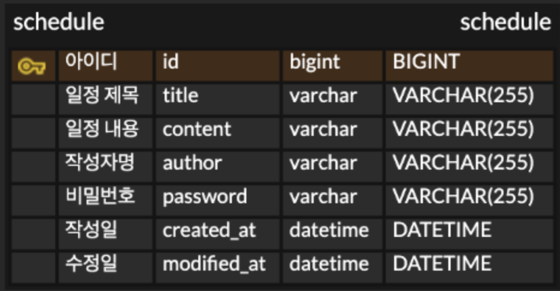

# 일정 관리 API

일정을 생성하고 조회, 수정, 삭제할 수 있는 API 입니다.
Spring Boot와 JPA를 사용했습니다.

## API 명세서

### 일정 생성
- POST /schedules
- request
```json
{
    "title": "공부하기",
    "content": "Spring 공부하기",
    "author": "민병준",
    "password": "1234"
}
```
- response
```json
{
    "id": 1,
    "title": "공부하기",
    "content": "Spring 공부하기",
    "author": "민병준",
    "createdAt": "2026-04-13T16:41:59",
    "modifiedAt": "2026-04-13T16:41:59"
}
```

### 전체 일정 조회
- GET /schedules
- 작성자명으로 조회하고 싶으면 GET /schedules?author=민병준 이렇게 하면 됩니다
- request: 없음
- response
```json
[
    {
        "id": 1,
        "title": "공부하기",
        "content": "Spring 공부하기",
        "author": "민병준",
        "createdAt": "2026-04-13T16:41:59",
        "modifiedAt": "2026-04-13T16:41:59"
    }
]
```
수정일 기준 내림차순으로 정렬됩니다.

### 선택 일정 조회
- GET /schedules/{id}
- request: 없음
- response
```json
{
    "id": 1,
    "title": "공부하기",
    "content": "Spring 공부하기",
    "author": "민병준",
    "createdAt": "2026-04-13T16:41:59",
    "modifiedAt": "2026-04-13T16:41:59"
}
```

### 일정 수정
- PUT /schedules/{id}
- 제목이랑 작성자명만 수정할 수 있습니다
- 비밀번호가 맞아야 수정됩니다
- request
```json
{
    "title": "수정된 제목",
    "content": "Spring 공부하기",
    "author": "수정된 작성자",
    "password": "1234"
}
```
- response
```json
{
    "id": 1,
    "title": "수정된 제목",
    "content": "Spring 공부하기",
    "author": "수정된 작성자",
    "createdAt": "2026-04-13T16:41:59",
    "modifiedAt": "2026-04-13T17:00:00"
}
```

### 일정 삭제
- DELETE /schedules/{id}
- 비밀번호가 맞아야 삭제됩니다
- request
```json
{
    "password": "1234"
}
```
- response: 없음 (200 OK만 반환)

비밀번호는 모든 응답에서 제외했습니다.

## ERD


